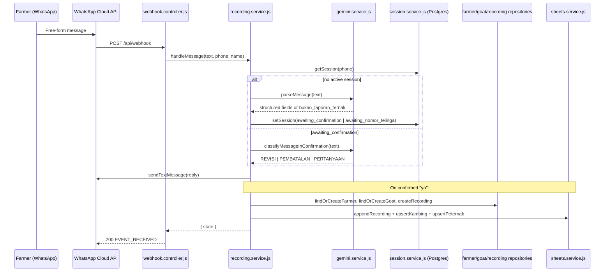
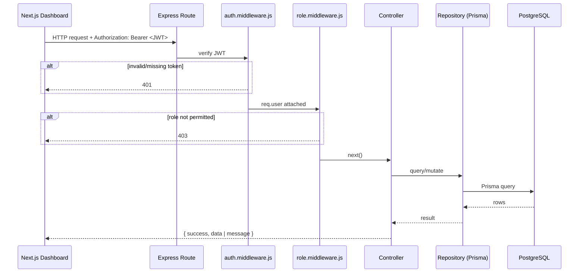

# Request Lifecycle

Two distinct request flows exist: the **WhatsApp webhook flow** (unauthenticated, driven by Meta) and the **dashboard REST API flow** (JWT-authenticated, driven by the Next.js frontend).

## WhatsApp report flow

Image messages follow the same path via `handleImageMessage`, which downloads the media from Meta, validates MIME type/size, uploads to Cloudinary, then delegates to `handleMessage` with the caption as the report text (see [`api/webhook.md`](../api/webhook.md)).

## Dashboard REST API flow

`GET` list/detail endpoints generally only require `authMiddleware` (any logged-in role, including `VIEWER`); create/update/delete endpoints additionally require `requireRole('ADMIN', 'SUPERADMIN')`. `/api/admins/*` requires `SUPERADMIN`. See each file under [`api/`](../api/) for exact per-endpoint requirements, and [`backend/authentication.md`](../backend/authentication.md) for how the JWT is issued and verified.
