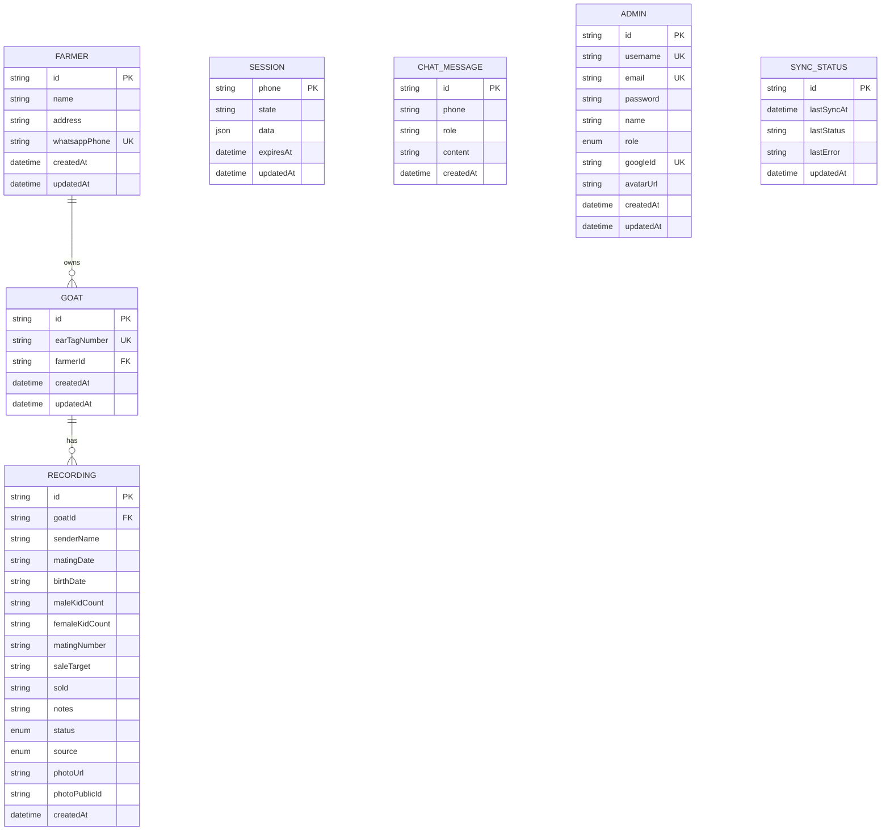

# Database Schema

PostgreSQL via Prisma ORM (`backend/prisma/schema.prisma`). Table names are snake_case (`@@map`), fields map camelCase Prisma models to snake_case columns (`@map`).

## Entities

| Model | Table | Purpose |
|---|---|---|
| `Farmer` | `farmer` | A registered livestock owner (peternak) |
| `Goat` | `goat` | A goat, identified by a unique ear tag number |
| `Recording` | `recording` | One health/breeding report for a goat |
| `Session` | `session` | Active WhatsApp conversation state (see [system-design.md](system-design.md#conversation-state-machine)) |
| `ChatMessage` | `chat_message` | WhatsApp conversation history, used to give Gemini short-term memory |
| `Admin` | `admin` | Dashboard user (password and/or Google OAuth) |
| `SyncStatus` | `sync_status` | Singleton row tracking the last DB → Sheets sync attempt |

## ERD

## Notes on modeling choices

- **`Goat.farmerId` and `Recording.goatId` cascade on delete.** Deleting a farmer removes their goats and all recordings, and deleting a goat removes its recordings.
- **Most `Recording` fields are `String`, not typed dates/numbers.** Farmers report dates and counts in free text ("kemarin", "2 ekor"); Gemini normalizes dates to `DD/MM/YYYY` but the schema stores everything as strings with a `"-"` sentinel for "not provided" (see [`api/error-response.md`](../api/error-response.md) and `config.dataSchema` in `backend/src/config/index.js`), to avoid forcing partial/uncertain AI output into strict types.
- **`Recording.status`** — `PERLU_REVIEW` (needs review) for AI-sourced reports (`source: WA`), `FINAL` for anything created manually via the dashboard (`source: MANUAL`) or after an admin confirms it.
- **`Session`** is keyed by phone number (not farmer ID) because a session can exist before a `Farmer` row is created — the farmer is only persisted once they confirm a report.
- **`Admin.password`** is nullable — accounts created via Google OAuth linkage may never set a password.
- **`SyncStatus`** always has a single row with `id: "singleton"`, upserted rather than inserted, so the dashboard can read sync health without a scan.

See [`database/prisma.md`](../database/prisma.md) for query conventions and [`database/migration.md`](../database/migration.md) for how schema changes are applied.
