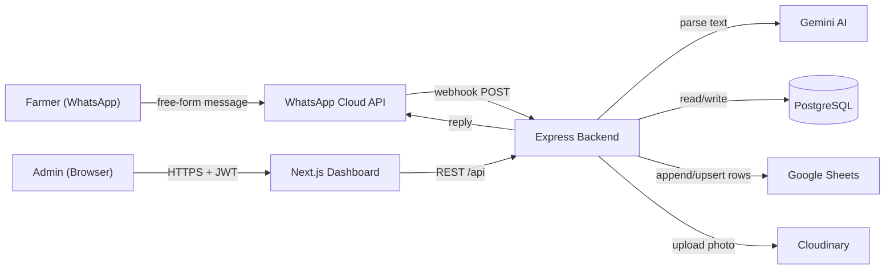
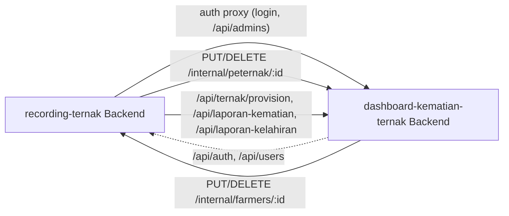

# System Design

## Overview

Recording Ternak digitalizes livestock (goat) health record-keeping for a KKN (community service) project. Farmers send free-form WhatsApp messages in casual Indonesian describing events like matings, births, and sales. Gemini AI parses these messages into structured data, which is stored in PostgreSQL and mirrored in real time to a Google Spreadsheet so non-technical stakeholders (village officials, veterinary partners) can view it without touching the app.

A companion Next.js dashboard lets admins manage farmers, goats, and recordings directly, review AI-submitted reports, and monitor sync health.

## Components

| Component | Responsibility |
|---|---|
| WhatsApp Business Cloud API (Meta) | Receives farmer messages, delivers bot replies |
| Backend (Express, `backend/`) | Webhook handling, AI parsing orchestration, REST API for the dashboard, Sheets sync |
| Gemini AI (`gemini.service.js`) | Parses free-form Indonesian text into structured fields; classifies intent during confirmation; answers ad-hoc data questions; generates casual chat replies |
| PostgreSQL (Prisma) | System of record: farmers, goats, recordings, WhatsApp conversation sessions, chat history, admins, sync status |
| Google Sheets | Read-only mirror of the database for stakeholders; kept in sync after every save and self-heals via a row-count consistency check |
| Cloudinary | Stores farmer-submitted and dashboard-uploaded goat photos |
| Frontend (Next.js, `frontend/`) | Admin dashboard: CRUD for farmers/goats/recordings, follow-up reminders, sync status, charts |

## High-Level Flow

## Conversation State Machine

WhatsApp is stateless between messages, so the backend runs as a serverless function on Vercel — consecutive requests from the same farmer can land on different lambda instances. Conversation state is therefore persisted in the `session` table (not in-memory) so any instance can pick up where the last one left off. See [`database-schema.md`](database-schema.md) for the `Session` model and [`backend/authentication.md`](../backend/authentication.md) for how this differs from admin-dashboard auth.

States:

- *(none)* — new message, no pending report. Gemini parses it; if it's a livestock report, move to `awaiting_nomor_telinga` (missing ear tag) or `awaiting_confirmation` (complete).
- `awaiting_nomor_telinga` — report parsed but missing the goat's ear tag number; next message is expected to contain just the number.
- `awaiting_confirmation` — full report summarized back to the farmer; next message is classified as confirm (`ya`), cancel (`tidak`), a revision (new data), or an unrelated question.

Sessions expire after 10 minutes (`session.service.js`). See [`api-flow.md`](api-flow.md) for the full sequence diagram.

## Data Consistency: DB ↔ Sheets

Every saved report triggers an async, non-blocking `verifySheetsConsistency()` call (`sync.service.js`) that compares row counts between Postgres and each Sheets tab. On mismatch, it runs a full sync (`runFullSync`) that clears and rewrites all three sheets from the database. This keeps Sheets as a best-effort mirror without making the farmer's reply wait on Sheets API latency. Admins can also trigger this manually via `POST /api/sync/retry` (see [`api/sync.md`](../api/sync.md)).

## Cross-App Integration: dashboard-kematian-ternak

Recording Ternak's backend also acts as the **shared auth service and a client** of a separate sibling app, dashboard-kematian-ternak (death/birth report registry for all village livestock, not just goats). Three things cross the app boundary:

1. **Users.** The `admin` table here is the merged users table for both apps — dashboard has no local users, its auth/user-management endpoints proxy here.
2. **Farmers ↔ Peternak.** `Farmer` here and `Peternak` there are separate tables, kept in sync (same row id) by pushing every create/update/delete to the other app's `/internal/*` endpoints.
3. **Kematian/kelahiran generation.** `POST /api/kematian/goats/:goatId/generate` and `POST /api/kelahiran/goats/:goatId/generate` call dashboard's API to provision a `Ternak` (always jenis `"Kambing"`), create the report, and stream back the generated document — no document logic lives here.

See [ADR-006](../decisions/adr-006-integration-with-dashboard-kematian-ternak.md) for why this is HTTP-to-HTTP rather than a shared database, [`api/kematian.md`](../api/kematian.md), [`api/kelahiran.md`](../api/kelahiran.md), and [`api/internal.md`](../api/internal.md).

## Related docs

- [Folder structure](folder-structure.md)
- [Database schema](database-schema.md)
- [API request flow](api-flow.md)
- [ADR-003: Gemini AI for NLP parsing](../decisions/adr-003-gemini-ai-parsing.md)
- [ADR-004: Google Sheets as stakeholder mirror](../decisions/adr-004-google-sheets-sync.md)
- [ADR-006: Integration with dashboard-kematian-ternak](../decisions/adr-006-integration-with-dashboard-kematian-ternak.md)
